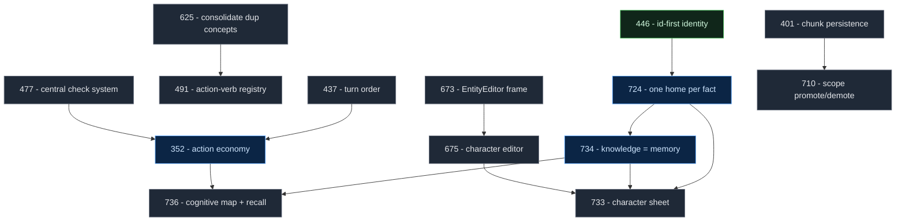
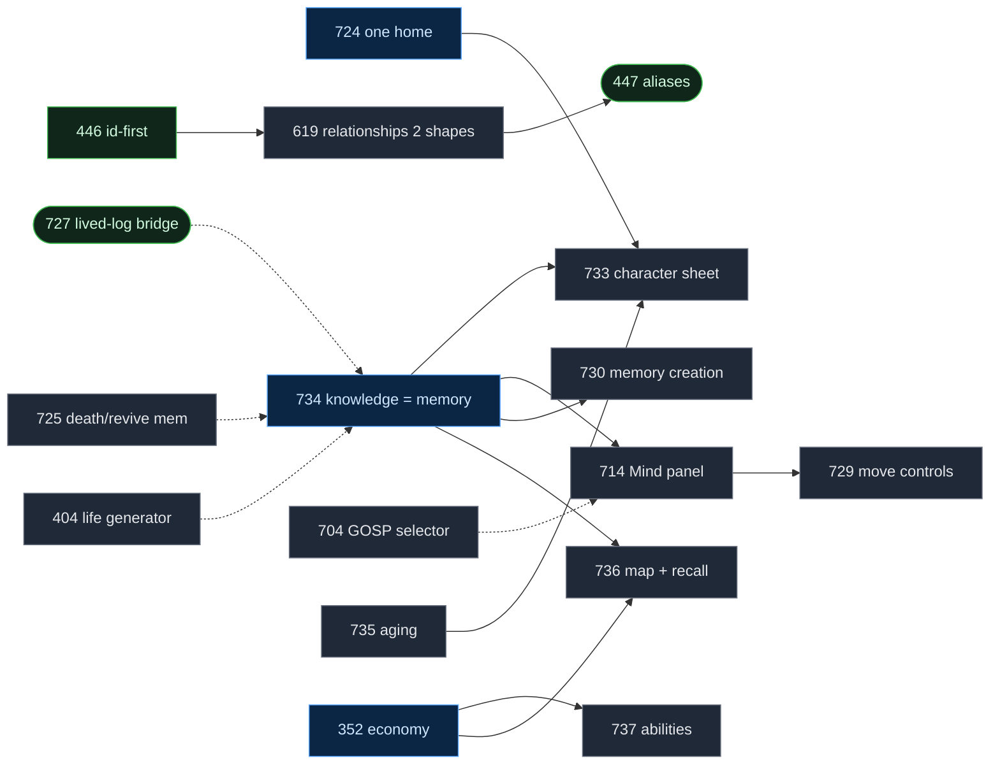
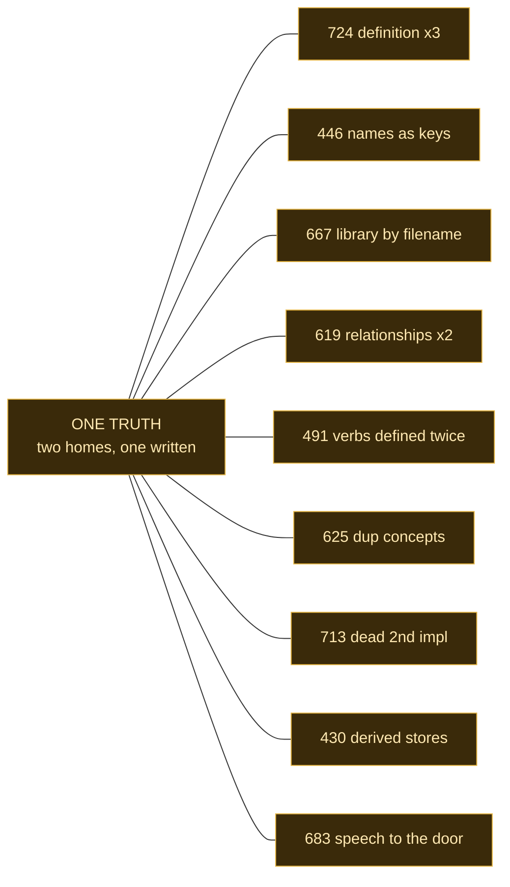
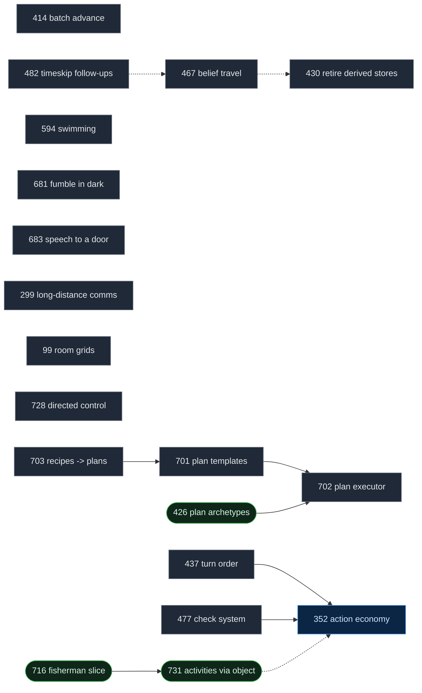
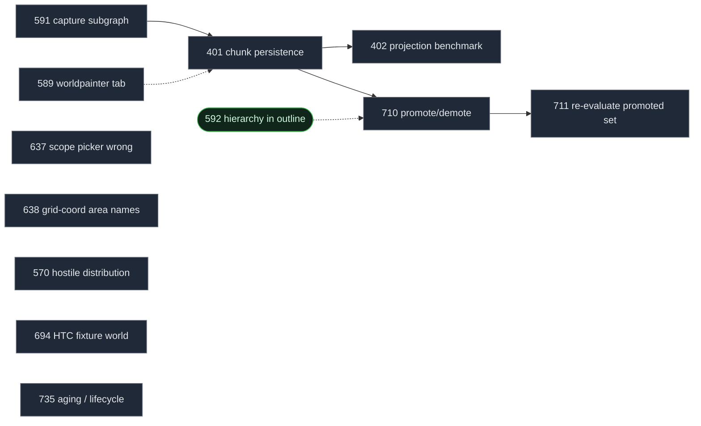
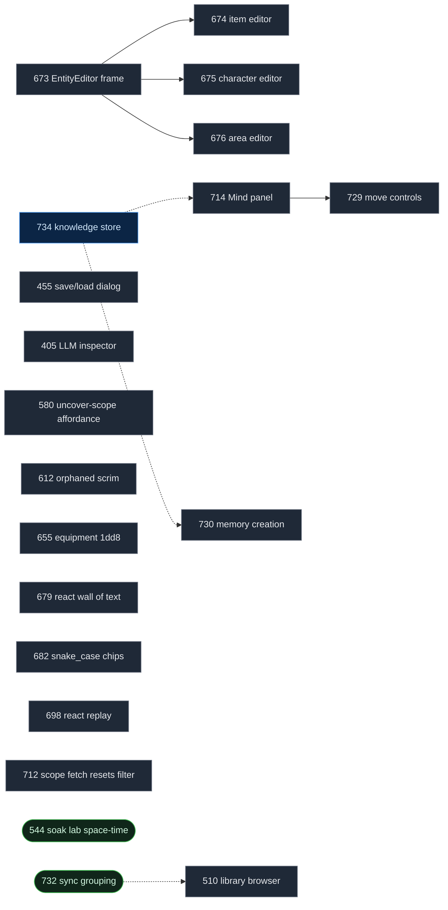
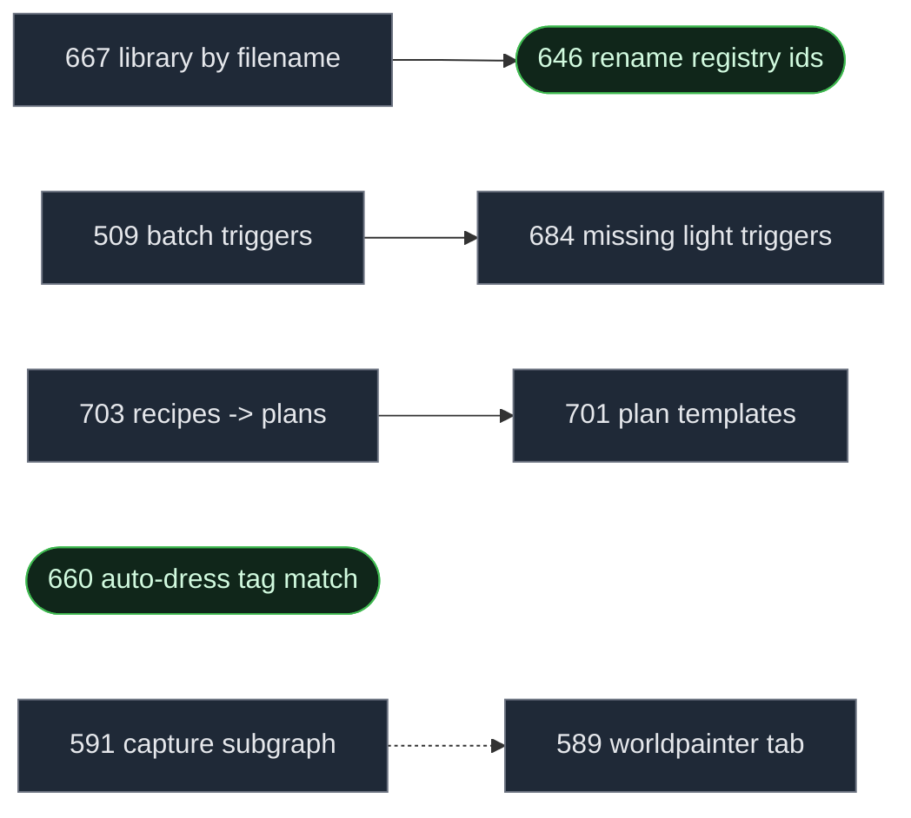

# Roadmap — Dependency Map (open work)

*Written 2026-10-07. Scope: the **102 open** cards (86 `todo` + 16 `inprogress`) in
`docs/virtualWorld/dev_tasks/`. `review`/`done`/`cancelled` are excluded. The folder
tree and `python tools/tasks.py list` stay authoritative; this file is the dependency
picture they lack.*

**How to read it.** `-->` is a real prerequisite (A needs B first). `-.->` is
related/soft. Colour is status: **blue = decisions locked / startable**, **green =
in progress**, **grey = todo**, **amber = the one-truth register**. The platform spine
(first graph) shows only tasks something else depends on; the per-area graphs show the
detail; the table is the sortable inventory.

## Legend

| marker | meaning |
|---|---|
| `-->` | hard dependency |
| `-.->` | related / soft |
| blue node | decisions locked, startable now |
| green node | in progress |
| grey node | todo |
| amber | one-truth register (not a task) |

---

## 1. Platform spine — what other work sits on



## 2. Character / mind cluster



## 3. The one-truth register — the recurring disease

Nine open cards are the *same* bug: two places hold one truth and only one gets
written. This is the roadmap's own Rule 1, caught again.



## 4. Gameplay, plans and economy



## 5. World and scale



## 6. UI and editors



## 7. Library and content



---

## The complete inventory

Status: `todo`, `wip` = in progress, `ready` = decisions locked / startable now.

### Characters

| Task | Status | Depends on | Summary |
|---|---|---|---|
| bug-519 | todo | — | editorial rewrite notes stored inside memories |
| task-404 | todo | 734 (soft) | character life-experience generator |
| task-409 | todo | — | background schedules, work, coarse social |
| task-619 | todo | 446 | relationships stored in two shapes in one field |
| task-665 | todo | — | Kraktooth cast rework half-migrated |
| task-704 | todo | 714 (soft) | GOSP selector needs memory and personality |
| task-725 | todo | 734 (soft) | memories lack death / travel / resurrection |
| task-733 | todo | 724, 735, 734 | character sheet: WorldGraph form → primitives |
| task-734 | **ready** | — | knowledge is memory; per-kind lifecycles |
| task-736 | todo | 734, 352 | cognitive map + `recall` |
| task-737 | todo | 352 | intrinsic abilities: grant/revoke, not droppable |
| task-447 | wip | — | nicknames / aliases |
| task-534 | wip | — | missing body reaction: sneeze |
| task-727 | wip | 734 (soft) | lived-log → memory bridge |

### Gameplay

| Task | Status | Depends on | Summary |
|---|---|---|---|
| task-299 | todo | — | long-distance communication |
| task-352 | **ready** | 437, 477 | action economy, free / minor / major |
| task-414 | todo | — | batch time advance, non-blocking human |
| task-430 | todo | — | retire `visited_areas` / `discovered_items` |
| task-437 | todo | — | turn order source of truth and modes |
| task-467 | todo | — | belief-based travel, heading, hearsay |
| task-477 | todo | — | combat and grapple on the central check system |
| task-482 | todo | — | timeskip follow-ups, leisure vendors |
| task-594 | todo | — | swimming navigation, diving, air vital |
| task-681 | todo | — | fumbling in the dark, partial result |
| task-683 | todo | — | witnessed speech attributed to a door |
| task-702 | todo | 701, 426 | plan executor runtime |
| task-728 | todo | — | directed control mode |
| task-99 | todo | — | room grids and movement |
| task-426 | wip | — | plan archetypes and group goals |
| task-671 | wip | — | timeskip intent that cannot be carried out |
| task-716 | wip | 731 | fisherman vertical slice |
| task-731 | wip | — | activities entered through their object |

### World

| Task | Status | Depends on | Summary |
|---|---|---|---|
| task-401 | todo | — | chunk persistence and gateway ways |
| task-402 | todo | 401 | world scale projection benchmark |
| task-570 | todo | — | hostile distribution consumer |
| task-637 | todo | — | area scope picker shows the wrong scope |
| task-638 | todo | — | areas named after grid coordinates |
| task-694 | todo | — | HTC fixture world |
| task-710 | todo | 401 | scope selection drives the promoted set |
| task-711 | todo | 710 | re-evaluate the promoted set every tick |
| task-735 | todo | — | aging and lifecycle for long-horizon soaks |

### UI and editors

| Task | Status | Depends on | Summary |
|---|---|---|---|
| task-405 | todo | — | LLM raw request/response inspector |
| task-455 | todo | — | save/load dialog UX |
| task-510 | todo | — | library browser UI overhaul |
| task-580 | todo | — | uncover-scope generate affordance |
| task-612 | todo | — | person context menu orphaned scrim |
| task-655 | todo | — | equipment readout renders 1dd8 |
| task-673 | todo | — | EntityEditor frame |
| task-674 | todo | 673 | item editor actions matrix |
| task-675 | todo | 673 | character editor three-column |
| task-676 | todo | 673 | area editor split view |
| task-679 | todo | — | react phase is one wall of text |
| task-682 | todo | — | scene chips leak snake_case ids |
| task-698 | todo | — | react phase replay |
| task-712 | todo | — | failed scope fetch resets the filter |
| task-714 | todo | 734, 691 | character Mind panel |
| task-729 | todo | 714 | move relationship/emotion/memory editors into Mind |
| task-730 | todo | 734 | interactive memory creation |
| task-544 | wip | — | soak lab space-time view |
| task-592 | wip | — | one hierarchy: scopes at the top of the outline |
| task-732 | wip | 526 | sync grouping and review queue |

### Library and content

| Task | Status | Depends on | Summary |
|---|---|---|---|
| task-509 | todo | 684 | batch generate triggers for selected items |
| task-589 | todo | 401 (soft) | worldpainter category tab |
| task-591 | todo | 401 | structures: capture a subgraph |
| task-667 | todo | 446 | library entries keyed by filename |
| task-684 | todo | — | matches/candlestick light triggers missing |
| task-701 | todo | — | plan template library |
| task-646 | wip | 667 | rename space-separated registry ids |

### Refactor and engine health

| Task | Status | Depends on | Summary |
|---|---|---|---|
| task-332 | todo | 625 | migrate legacy item effect props to triggers |
| task-440 | todo | — | split backend runner-up files |
| task-441 | todo | — | split frontend giants and trigger tests |
| task-454 | todo | — | save list must not parse every save |
| task-456 | todo | — | split saveload view concerns |
| task-491 | todo | 625 | single source for action verbs (scoped registry) |
| task-625 | todo | — | duplicated concepts across the engine |
| task-696 | todo | — | server log file, route identity |
| task-713 | todo | — | `attention.py` dead second implementation |
| task-715 | todo | — | live update transport will not scale |
| task-724 | **ready** | 446 (soft) | player state in multiple homes |
| task-83 | todo | — | code readability refactor |
| task-446 | wip | — | id-first node identity |

### Prompting and narration

| Task | Status | Depends on | Summary |
|---|---|---|---|
| bug-517 | todo | 692 (soft) | AI narration broadcast as character speech |
| bug-523 | todo | 692 (soft) | plan grounding uses unmasked real names |
| task-692 | todo | — | narration v2: DM layer, not a client rewriter |

### Graph editor

| Task | Status | Depends on | Summary |
|---|---|---|---|
| task-290 | todo | — | template variants and override tracking |
| task-422 | todo | — | NL editor LLM budget controls |
| task-435 | todo | — | offline generators still mint way templates |
| task-461 | wip | — | NL editor validation gate |

### Testing and docs

| Task | Status | Depends on | Summary |
|---|---|---|---|
| task-693 | todo | — | e2e verification harness |
| task-697 | todo | 693 (soft) | validate gate requires a checked acceptance box |
| task-668 | todo | — | `room-context.js` body mojibaked UTF-8 |
| task-669 | todo | — | doc headers on 162 Python modules |
| task-672 | todo | — | inspector-panels doc describes controls that do not exist |
| task-695 | todo | 587 | live verification playbook |
| task-574 | wip | — | test guide: the worldpainter session |
| task-587 | wip | — | executable manual test plan |

### Misc (conditions / engine / environment / items)

| Task | Status | Depends on | Summary |
|---|---|---|---|
| task-705 | todo | — | requirement condition leaves quantity/area/knowledge/ownership |
| task-708 | todo | — | despawn effect: remove a character from a trigger |
| task-555 | todo | — | wind gets a direction |
| task-556 | todo | — | weather reaches the world, snow accumulation |
| task-703 | todo | 701 | recipes become plan templates |
| task-660 | wip | — | auto-dress deterministic tag matching |

---

## Startable now (no unmet dependency)

- **task-352** action economy — decisions locked.
- **task-734** knowledge = memory — independent, and the load-bearing one.
- **task-735** aging / lifecycle — needs only the time/soak clock.
- **task-731** activities via object — in flight.
- **task-732** sync grouping — continues on the landed bug-526 fix.

## Critical path

```
446 ─▶ 724 ─▶ 734 ─▶ 736
              └────▶ 733 ◀─ 735
352 ─▶ 736, 737
673 ─▶ 675 ─▶ 733
401 ─▶ 710 ─▶ 711
```

**734 is the linchpin**: the mind panel, the map, the sheet's biography and the memory
creation flow all read/write it. Build it before piling more authoring (733) or more
views (736/714) on top, or each consumer relearns five separate knowledge stores.

## Landed this session (uncommitted)

- **bug-524** fix: node is the authored home; live read publishes it;
  `to_scenario_dict` strips the duplicate; inspector edit mirrors to the node.
  Live-verified.
- **bug-525** fix: death ends the character's activity (no forced `wake`).
- **bug-526** fix: Sync All is tab-scoped and skips generated entities.
- **task-731** core: furniture templates wired to activities; bare `fish` deleted.
- **task-732** core: item instances collapse into template rows.
- Docs: `AGENTS.md` invariant rewritten; `docs/design/character-inner-life-threads.md`.

*Python/library changes need a server restart to be live; frontend changes are live on
reload.*
